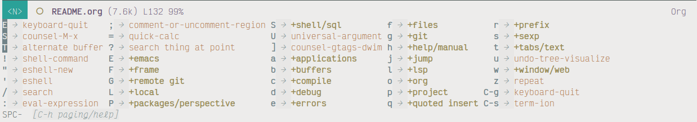

```
   _______                     _______
  (_______)                   (_______)
   _______ _____  ____ ___     _____   ____  _____  ____  ___
  |  ___  | ___ |/ ___) _ \   |  ___) |    \(____ |/ ___)/___)
  | |   | | ____| |  | |_| |  | |_____| | | / ___ ( (___|___ |
  |_|   |_|_____)_|   \___/   |_______)_|_|_\_____|\____|___/
  .-  .  .-.  ---  .  --  .-  -.-.  ...
```

# Aero Emacs

Here lives my own configuration for GNU Emacs, blending all the best shit I can find, making a conscious effort for speed, robustness and above all, skillfulness. There are many like it, but this one is mine.

<br>

> "Configuring Emacs is more of a lifestyle choice than a task that one completes."<br><br>  — Stephen Ramsey

<br>

## Features

### Spacemacs-like leader keys

> "An infinite number of monkeys typing into GNU Emacs would never make a good program."<br><br>  — Linus Torvalds

When I first started using Emacs, I took full advantage of Spacemacs, so the architecture of that project has shaped the way I think about editing. As such, the majority of Aero revolves around a single leader key, `SPC`. For example, `SPC SPC` is the same as `M-x`, `SPC f w` (for file write) saves the buffer to disk.

Aero also provides a "mode leader", `SPC ,`, which contains bindings for specific major modes. For example, in Python mode, `SPC , s b` sends the entire buffer to Elpy's inferior Python shell and executes it, and in `restclient`, `SPC , RET` runs the HTTP query at point.



> "Emacs is a great operating system, lacking only a decent editor." — ancient Vi proverb

For everything else, Aero makes extensive use of [Evil](https://github.com/emacs-evil/evil), providing the user with modifier-key-free modal editing, though the majority of Emacs bindings remain available. Emacs keybindings belong in the dark ages where they originated. They might work for RMS, but I can only hold `CTRL` for so long.

### AI Assistant

Aero includes a built-in package, Aero Assistant, which interfaces with [currently only] OpenAI models like GPT. Aero provides a text interface for free-form GPT interaction, plus a growing list of features, including writing commit messages.

### Custom theme with simplified mode line

Aero replaces the default awful color scheme with the eponymous `aero-theme`, which pulls loose inspiration from the [Tao themes](https://github.com/11111000000/tao-theme-emacs) and colors inspired by northern Minnesota in Autumn. The theme package also contains `aero-dark`, which incorporates further inspiration from my own [ClearNight Retro](https://github.com/ClearNight/clearnight-retro-syntax) theme for [Atom](https://atom.io) (may it rest in peace).

With Aero, you'll also find a custom improved mode line which works with any theme (though it looks great with `aero-light` and `aero-dark`). Rather than getting cluttered with info from every mode under the sun, the Aero mode line displays the current editing mode, file status (changed, saved, locked), filename, file size, line number at point, progression through the file (percentage), the remote hostname (if using TRAMP) and the current major mode.

## Requirements

Aero evolves as a cutting-edge tool and focuses on working with the latest version of Emacs, but you can generally assume support for the last version too.

## Installation

```sh
git clone https://gitlab.com/thornjad/aero.git ~/.config/emacs && cd ~/.config/emacs
make init
```

The `make init` will install dependencies needed for LSP servers, using any tools already available on the system (e.g. it will not error if `opam` isn't installed). It will also set up and update any submodules required for Aero.

Upon starting up Emacs for the first time, further third-party packages will automatically download and install via `straight.el`. Subsequent startups should take one or two seconds. If you encounter any errors at this stage, try restarting Emacs and/or opening a bug.

### Mirrors

- https://github.com/thornjad/aero.git
- https://gitlab.com/thornjad/aero.git
- https://framagit.org/thornjad/aero.git
- https://codeberg.org/thornjad/aero.git

### Installation of Emacs using Aero build scripts

Aero includes some convenient scripting to install Emacs on Linux and Mac, with both a stable and cutting-edge version supported for Mac.

#### Build script install Emacs on Linux

``` sh
make linux
```

The `linux` target will call `linux.zsh`, which installs requirements, configures, builds and installs the latest version of Emacs.

Features:

- Native compilation
- Native JSON support
- Elisp threads
- Tree-sitter

#### Build script install Emacs on MacOS

Unlike Linux, installing and running Emacs on MacOS can be flaky, so several installation options are provided. Use the one that works best on your machine.

- `build-emacs-macos`: This is the preferred option, installing the development version of Emacs with native compilation and XWidgets support.
- `build-emacs-macos-stable`: A fallback option, installing the mainline release version of Emacs, with native compilation and XWidgets support.
- `build-emacs-macos-minimal`: Same as `build-emacs-macos` but without native compilation.
- `build-emacs-macos-stable-minimal`: Same as `build-emacs-macos-stable` but without native compilation.
- `build-emacs-cask`: Install the standard Homebrew Cask `emacs-nightly` package, still cutting-edge but should be more stable than the previous options.
- `build-emacs-cask-stable`: The final fallback, the standard Homebrew Cask `emacs` package.
- Note that Aero does not profess support for the pre-installed version of Emacs on MacOS; it is infrequently updated and Aero focuses on the development version of Emacs.

## Note

This configuration undergoes constant evolution. Bindings, settings and packages change with no warning and little to no documentation. This project does not exist as a prebuilt configuration like Spacemacs, but rather as a reference or source of ideas. Use at your own risk.

To get started with Emacs, I highly recommend [Spacemacs](https://spacemacs.org).

## Credits and acknowledgments

Like the Borg, Aero amalgamates macros, functions, bindings and packages modified from or inspired by a plethora of developers. Special thanks to these fantastic people, with links to the invaluable resource they provide:

- [Sacha Chua](https://github.com/sachac/.emacs.d)
- [Karl Fogel](https://svn.red-bean.com/repos/kfogel/trunk/.emacs)
- [Wilfred Hughes](https://github.com/Wilfred/.emacs.d)
- [John Wiegley](https://github.com/jwiegley/dot-emacs)
- [Steve Purcell](https://github.com/purcell/emacs.d)
- [Samuel Barreto](https://github.com/sam217pa/emacs-config)

## License

Copyright © 2016-2024 Jade Michael Thornton

Permission to use, copy, modify, and/or distribute this software for any purpose with or without fee
is hereby granted, provided that the above copyright notice and this permission notice appear in all
copies.

The software is provided "as is" and the author disclaims all warranties with regard to this
software including all implied warranties of merchantability and fitness. In no event shall the
author be liable for any special, direct, indirect, or consequential damages or any damages
whatsoever resulting from loss of use, data or profits, whether in an action of contract, negligence
or other tortious action, arising out of or in connection with the use or performance of this
software.
