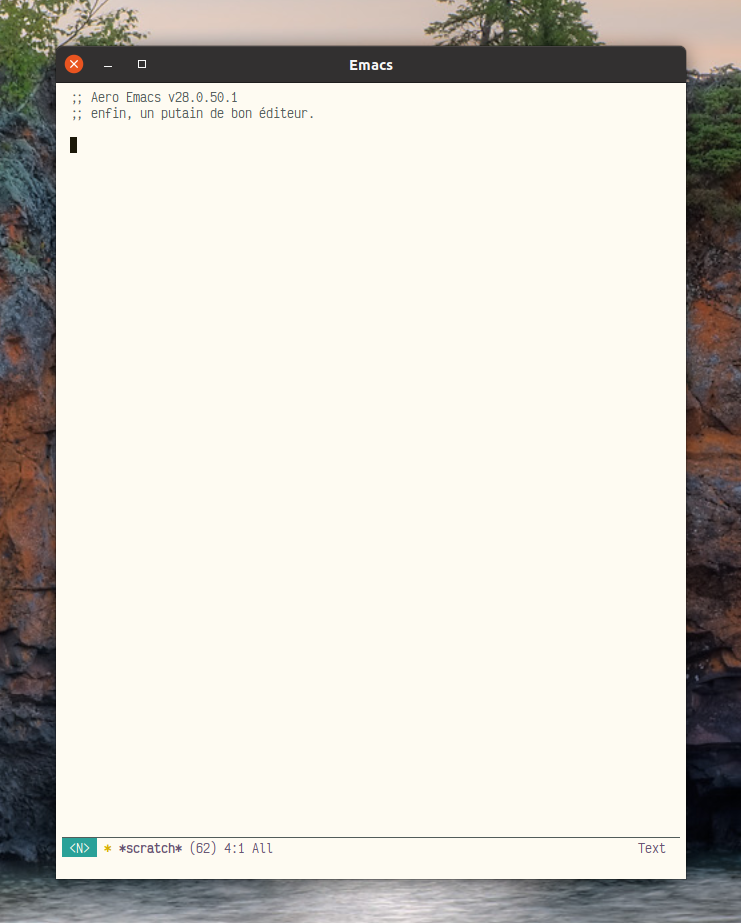

# Aero Emacs



Here lives my own Emacs configuration, blending all the best shit I can find, making a conscious effort for speed, robustness and above all, skilfullness.. I built Aero in the style of a distribution like Prelude or Spacemacs, but without intention for widespread use; I've tailored Aero to myself,, what I want and what I use. Configuration for Lisps, Python and web languages have special focus.

> "An infinite number of monkeys typing into GNU Emacs would never make a good program." — Linus Torvalds

> "Emacs outshines all other editing software in the same way that the noonday sun does the stars. It is not just bigger and brighter; it simply makes everything else vanish." — Neal Stephenson

> "You could be a total lunatic, and Emacs has to make you happy" — Steve Yegge

## Requirements

Aero evolves as a cutting-edge tool and focuses on working with the latest version of Emacs, but you can generally assume support for the last version too.

### Required for LSP

Emacs continues to lack native language server support, but Aero implements this. To take full advantage of this feature, Aero requires some tools. Only install what you need:

- Node.js (multiple servers, including Bash/shell, Angular, Sass/CSS) 
- Deno (Javascript and Typescript, superior to Node.js for these languages)
- Python 3
- Rust and rustup
  - fd (improves project surfing performance)
  - ripgrep (improves searching performance)
- Ocaml and opam
- Nix 

## Installation

```sh
git clone https://gitlab.com/thornjad/aero.git ~/.config/emacs
cd ~/.config/emacs
make
```

## Local config

Local settings, functions, et cetera existing in an untracked `init.local.el` file will evaluate near the end of the initialization process, after all other layers and settings.

## Major features

### Evil

> "Emacs is a great operating system, lacking only a decent editor." — ancient Vi proverb

Emacs keybindings belong in the dark ages where they originated. They might work for RMS, but I can only hold `CTRL` for so long. Instead, Aero makes extensive use of [Evil](https://github.com/emacs-evil/evil), providing the user with modifier-key-free modal editing, though the majority of Emacs bindings remain available..

### Spacemacs-like leader keys

When I first started using Emacs, I took full advantage of Spacemacs, so the architecture of that project has shaped the way I think about editing. As such, the majority of Aero revolves around one of two leader keys, `SPC` and `,` (comma). `SPC` leads the vast majority of commands. `SPC SPC` is the same as `M-x`, `SPC f w` (for file write) saves the buffer to disk.

The other leader, `,` contains bindings for specific major modes. For example, in Python mode, `, s b` sends the entire buffer to Elpy's inferior Python shell and executes it, and in `restclient`, `, RET` runs the HTTP query at point.


### LSP

Emacs should support LSP out of the box. Since it doesn't, Aero makes up the difference by connecting to protocol servers as have proved useful to me thus far. I regularly make use of these capabilities in Python, OCaml and Javascript in particular, so they've received the most love.

### Custom theme with simplified mode line

Aero replaces the default awful color scheme with the eponymous `aero-theme`, which pulls loose inspiration from the [Tao themes](https://github.com/11111000000/tao-theme-emacs) and colors inspired by the colors of northern Minnesota in Autumn. The theme package also contains `aero-dark`, which incorporates further inspiration from my own [ClearNight Retro](https://github.com/ClearNight/clearnight-retro-syntax) theme for [Atom](https://atom.io).

With Aero, you'll also find a custom improved mode line which works with any theme (though it looks great with `aero-light` and `aero-dark`). Rather than getting cluttered with info from every mode under the sun, the Aero mode line displays the current editing mode, file status (changed, saved, locked), filename, file size, line number at point, progression through the file (percentage), the remote hostname (if using TRAMP) and the current major mode.

## Note

This configuration undergoes constant evolution. Bindings, settings and packages change with no warning and little to no documentation. This project does not exist as a prebuilt configuration like Spacemacs, but rather as a reference or source of ideas. Use at your own risk.

To get started with Emacs, I highly recommend [Spacemacs](https://spacemacs.org).

## Credits and acknowledgments

Like the Borg, Aero amalgamates macros, functions, bindings and packages modified from or inspired by a plethora of developers. Special thanks to these fantastic people, with links to the invaluable resource they provide:

- [Sacha Chua](https://github.com/sachac/.emacs.d)
- [Wilfred Hughes](https://github.com/Wilfred/.emacs.d)
- [Michael Markert](https://github.com/cofi/dotfiles)
- [Lee Hinman](https://github.com/dakrone/.emacs.d)
- [James Sulak](https://github.com/jsulak/.emacs.d)
- [John Wiegley](https://github.com/jwiegley/dot-emacs)
- [Steve Purcell](https://github.com/purcell/emacs.d)
- [Samuel Barreto](https://github.com/sam217pa/emacs-config)
- [Xah Lee](http://ergoemacs.org)

## License

Copyright © 2016-2021 Jade Michael Thornton

Permission to use, copy, modify, and/or distribute this software for any purpose with or without fee
is hereby granted, provided that the above copyright notice and this permission notice appear in all
copies.

The software is provided "as is" and the author disclaims all warranties with regard to this
software including all implied warranties of merchantability and fitness. In no event shall the
author be liable for any special, direct, indirect, or consequential damages or any damages
whatsoever resulting from loss of use, data or profits, whether in an action of contract, negligence
or other tortious action, arising out of or in connection with the use or performance of this
software.
